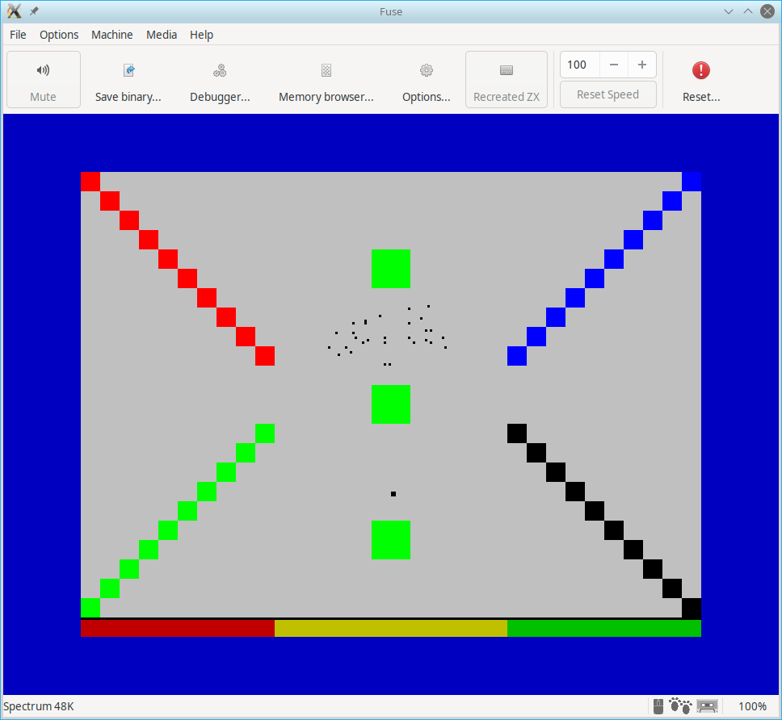

# The Virus

A game for the 48K ZX Spectrum home micro of the 1980s. The TAP file of
the latest release is [here](https://github.com/derekfountain/the-virus/blob/main/tv.tap).
Click that link, then click on "Download" (right side), and save as a TAP file. Then you
should be able to just drag and drop it onto your emulator window.

The source is released under the GPLv2 and builds on Linux with
[z88dk v2.10](https://github.com/z88dk/z88dk/releases/tag/v2.1) or greater.

This started off as a bit of experimentation with the Boids algorithm
on Linux. My original Tcl scripts are in the Tcl directory. When
playing with that I started to wonder how a ZX Spectrum would get on
with that algorithm. I ported it over to z88dk 'C' and learnt the
answer: not very well. So I converted the algorithm to use integers,
rewrote most of it, and optimised it as best I could short of
rewriting it in Z80 assembly language.

It turned out OK, so I built a game around it. :)

Credits:

Me, [Derek Fountain](https://www.derekfountain.org/), for writing it :)

Damien Guard, for the [font](https://damieng.com/typography/zx-origins/zx-eurostile)

[Andy Dansby](https://zxspectrumcoding.wordpress.com/) for his fast pixel plotting [work](https://spectrumcomputing.co.uk/forums/viewtopic.php?t=6727)

Conrad Parker for his [Boids work](https://vergenet.net/~conrad/boids/)